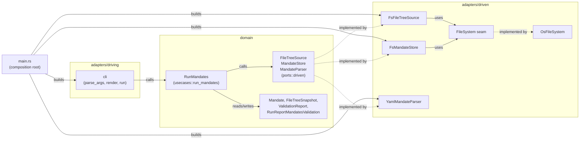

# Mandate parser, validator and run command

This is the architecture overview of the mandate parser, validator and run
command crate, for a reader who wants the big picture before going deeper
into any one part.

## Purpose

A Rust crate that finds a project's `.mandate` folder, parses every selected
mandate YAML file into a Rust value, validates each against the mandate
format and against one shared snapshot of the file tree, and reports every
problem it finds in one pass. It does not read or write `mandate.json` and
does not execute a rule; those are separate pieces that do not exist yet.

## Architecture at a glance

The crate follows the hexagonal ports and adapters pattern, scaled to the
size of the problem: the domain in the middle owns the interfaces it needs,
adapters on the outside implement them, and nothing inside depends on
anything outside. Here that means three driven ports, three adapters, and
one domain/usecases use case that owns discovery, selection and reporting.
Dependencies point inward: `main.rs` (the composition root) wires concrete
adapters into the domain, the CLI driving adapter calls the use case, and
the use case calls the three driven ports; nothing in the domain imports an
adapter.

Reading the picture from the left: `main.rs` builds the CLI driving adapter
and the three driven adapters (`FsFileTreeSource`, `FsMandateStore`,
`YamlMandateParser`). The CLI adapter calls the `RunMandates` use case in
the domain. `RunMandates` calls the three driven ports (`FileTreeSource`,
`MandateStore`, `MandateParser`) and reads and writes the domain model
types. Each port is implemented by exactly one of the driven adapters, and
the two filesystem-facing adapters, `FsFileTreeSource` and
`FsMandateStore`, both go through the `FileSystem` seam, which
`OsFileSystem` implements for real disk access.

## Where to read next

- [`run-command.md`](run-command.md): how one run flows end to end,
  discovery, selection, per-mandate outcomes, and the rendered report.
- [`ports-and-adapters.md`](ports-and-adapters.md): the file-by-file shape
  of the crate, the three driven ports' signatures, and the file system
  seam.
- [`testing.md`](testing.md): how the test suite is wired, the fixture
  cases, and how to run it.
- [`../reference/mandate-format-checks.md`](../reference/mandate-format-checks.md):
  what parsing rejects and what validation checks, structured for lookup.
- [`decisions/`](decisions/): the architecture decision records behind the
  choices above.
