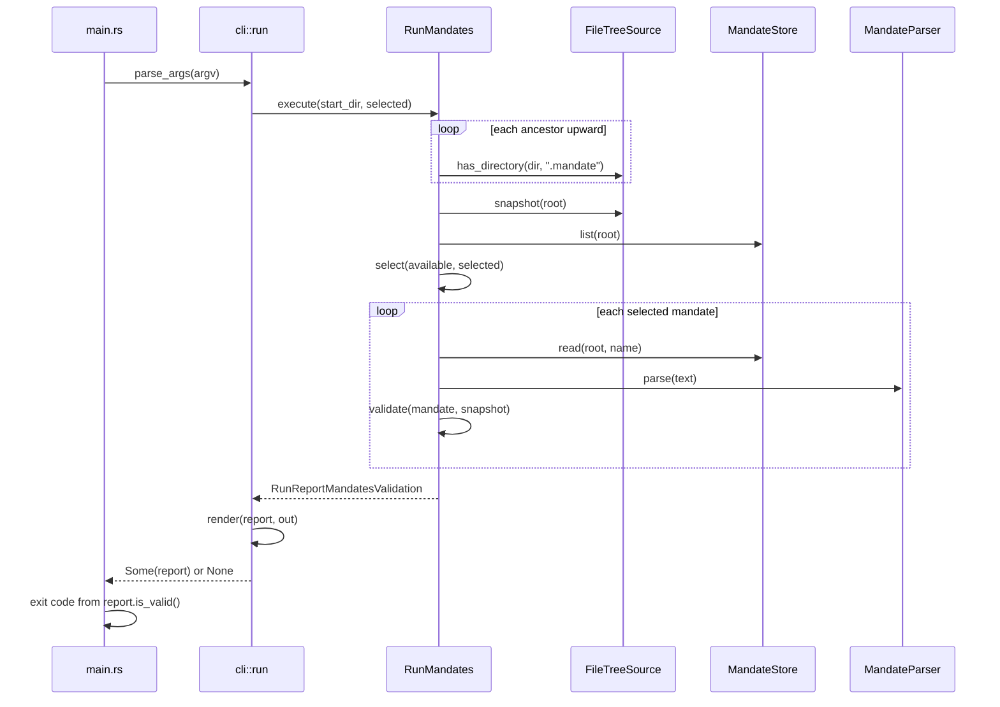

# The run command

This is the architecture overview of one flow through the mandate parser
crate, for a reader who wants to know what happens end to end when the
`mandate` command runs. See
[`mandate-parser-overview.md`](mandate-parser-overview.md) for the crate's
overall shape.

## How a run flows



In order, one run does this: `main.rs` calls `parse_args` on the CLI
adapter to turn the process arguments into an invocation, then calls
`execute` on `RunMandates` with the starting directory and the selected
mandate names. `RunMandates` checks each ancestor directory upward with
`FileTreeSource::has_directory` until it finds one holding `.mandate`,
takes one snapshot of that root with `FileTreeSource::snapshot`, and lists
the available mandates with `MandateStore::list`. It selects which
mandates to run, then for each one reads its text with `MandateStore::read`,
parses it with `MandateParser::parse`, and validates the parsed mandate
against the shared snapshot. The finished report goes back to the CLI
adapter, which renders it to the output writer, and back to `main.rs`,
which turns the report into an exit code.

**Discovery.** With no `--root`, discovery starts at the current directory.
`RunMandates::discover_root` checks each ancestor in turn with
`FileTreeSource::has_directory(dir, ".mandate")`, a cheap existence check
that answers `false`, rather than erroring, when a directory cannot be
read; if the check comes back false, it moves to the parent and repeats.
Reaching the filesystem root without finding one is not an error; the
report prints a warning instead and exits 0. It never looks inside child
directories, so a nested project with its own `.mandate` is ignored. Only
the ancestor that turns out to hold `.mandate` is ever snapshotted; every
ancestor tried above it gets only the existence check, never a full walk of
its tree. This is recorded in the doc comment on `discover_root`; snapshotting
every ancestor while searching meant walking directories the current user
does not own, and a real run failed with "Access is denied" on an unrelated
system temp folder before it could even report `.mandate` was never found.

**Snapshot.** `RunMandates` shares the one snapshot taken at the
discovered root across every mandate validated in the run. `validate`
never takes its own snapshot.

**Selection.** `MandateStore::list` returns the `.yaml` file names directly
in `.mandate/mandates/`. Selection is by full file name, case-sensitive; the
`name:` field inside a mandate is descriptive only and plays no part in
selection. With no names given on the command line, every listed mandate
runs. An empty mandates folder is `RunWarning::NoMandatesFound`, not an
error. A name on the command line that matches no file is
`RunError::UnknownMandate` and stops the run before anything is validated.

**Per-mandate outcome.** Every selected mandate is read, parsed and
validated in turn. A parse failure is recorded in that mandate's slot as
`MandateResult::ParseFailed`, and the run continues with the rest; it does
not stop the run the way an unknown name does.

**Reporting and exit codes.** `RunMandates` fills the report with everything
it finds; it never calls `std::process::exit`. The CLI adapter's `run` method
executes the use case, writes the report or error, and returns `Some(report)`
or `None`. `main.rs` wires the adapters, calls `cli::run`, and maps the result
to the exit code: `0` when the report is `Some` and `is_valid()` is `true`,
`1` otherwise. This split means a planned long-running mode can keep running
instead of exiting after an invalid report. Exit code `0` for an empty
mandates folder or when no `.mandate` folder is found, since a warning is
not a failure.

## The report

`RunReportMandatesValidation` in `src/domain/model/run_report.rs` is the domain
value the run command produces. Fields: `location` (a `RunLocation` enum
with variants `Found { root, snapshot_entries }` or
`NotFound { searched_from }`), `warnings` (a `Vec<RunWarning>`), and
`mandates` (a `Vec<MandateOutcome>`, one per selected mandate, each pairing
a file name with a `MandateResult` of `ParseFailed(MandateParseError)` or
`Validated(ValidationReport)`). `is_valid()`
is `true` when no outcome is a parse failure and every `ValidationReport` is
valid.

Nothing prints during the run: `RunMandates` only fills the report. The report
is plain data; the CLI adapter's `render` writes it out once the run is finished,
in the layout below.

The naming convention is `RunReport<Phase>`, so a later phase (rule
execution) gets its own `RunReport` type rather than growing this one.

Rendered layout when `.mandate` is found:

```
repository: <root>
snapshot: <n> entries

warning: no mandates found in <dir>      (only when it applies)

SOP_Orders.yaml
  error: governed document not found: docs/architecture/order-lifecycle.md
  invalid: 1 errors, 0 warnings

Networking.yaml
  valid: 3 rules, 2 documents, 7 source files

2 mandates checked, 1 invalid
```

When no `.mandate` folder is found from the starting directory upward:

```
warning: no .mandate folder found from <dir> up to the filesystem root

0 mandates checked, 0 invalid
```

Each mandate's block starts with its file name, then its `ValidationReport`
lines indented two spaces (or a `failed to parse: <message>` line for a
parse failure), then a summary line: `valid: ...` or
`invalid: <n> errors, <n> warnings`. The final line always reports the
total mandates checked and how many were invalid.

The message text each finding prints is defined in
[`../reference/mandate-format-checks.md`](../reference/mandate-format-checks.md).
