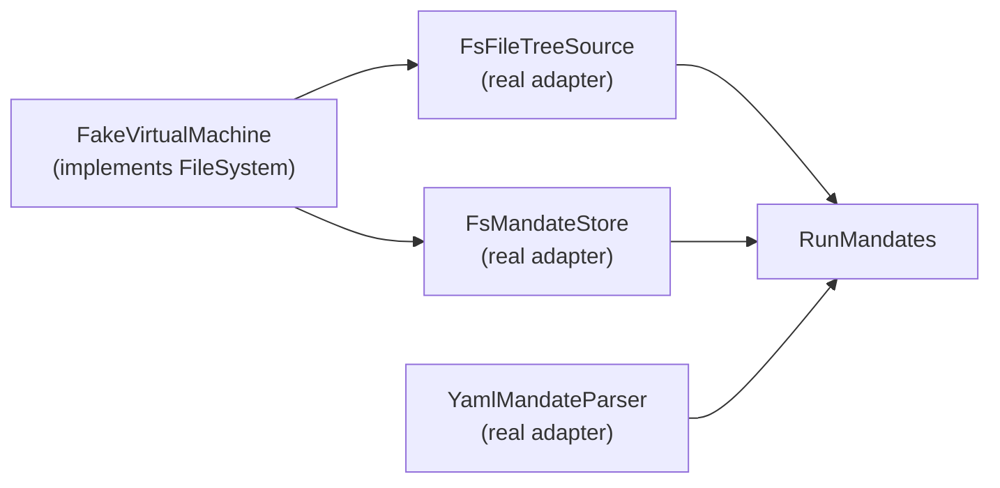

# Testing

This is the architecture overview of how the mandate parser crate's tests
are wired, for a reader who wants to know how the suite proves the crate's
behaviour and how to run it. See
[`mandate-parser-overview.md`](mandate-parser-overview.md) for the crate's
overall shape and [`ports-and-adapters.md`](ports-and-adapters.md) for the
`FileSystem` seam the fixtures build on.

Tests split the same way Rust and Cargo split them: a unit test lives in
the same file as the code it tests, under `#[cfg(test)]`, and may reach
private items; an integration test lives under `tests/`, compiles as a
separate crate, and can use only the public API.

| File | Kind | What it covers |
|---|---|---|
| `src/adapters/driven/mandate_parser/yaml_mandate_parser.rs` | unit, in-file | The five parse-error cases, with inline YAML. |
| `src/domain/model/validation.rs` | unit, in-file | Every validation error and warning, and their `Display` strings, using a private fake `&FileTreeSnapshot` builder so the domain test module imports nothing from an adapter. |
| `src/domain/usecases/run_mandates.rs` | unit, in-file | `RunMandates` behaviour with private doubles: discovery, selection, an unknown mandate name, a parse failure alongside a valid mandate, and an empty mandates folder. |
| `tests/fs_adapters.rs` | integration | `FsFileTreeSource` and `FsMandateStore` against real temporary directories, and `OsFileSystem` directly. |
| `src/adapters/driving/cli/mod.rs` | unit, in-file | Argument parsing and rendering (`validation_lines`, `report_lines`, `render`), with in-memory writers. No process is launched. `run` is exercised only by the `cli_run` fixture cases below. |
| `tests/fixtures/support.rs` | unit, in-file | `FakeVirtualMachine` (implements `FileSystem`, holds paths and mandate texts, built from a mandate with every linked file present, then edited with `add`, `remove`, `rename` and `with_mandate`) plus `parse`, `check` and the `assert_*` helpers. Fixtures build the real `FsFileTreeSource` and `FsMandateStore` over it. Has its own unit tests. |
| `tests/fixtures/<case>/mod.rs` | integration | One fixture case, one or more tests, inside the `fixtures` target. |
| `tests/architecture.rs` | integration, reads source text | Three tests enforcing the dependency rules: domain imports no adapter or vendor crate; adapters import no use case; only main.rs constructs concrete adapters. Never reads docs/, never runs the binary. |

Tests never read `docs/`, and no test runs the built binary. This repository
has no `.mandate/` folder to read.

Fixture tests wire the real driven adapters over one fake, so validator and
use case logic is exercised without a real disk. `FakeVirtualMachine` is
the only fake in this picture: it implements the `FileSystem` seam in
memory, holding paths and mandate texts instead of touching disk.
`FsFileTreeSource`, `FsMandateStore`, `YamlMandateParser` and
`RunMandates` are all the real, production adapters and use case, built
over that fake instead of over `OsFileSystem`. Because the adapters cannot
tell the difference between the fake and the real filesystem, exercising
them against fixture data proves their real behaviour without any test
double standing in for adapter logic itself:

In words: the fake virtual machine implements the `FileSystem` seam, and
the real `FsFileTreeSource` and `FsMandateStore` adapters are built on top
of it, the same way they would be built on `OsFileSystem` in production.
`RunMandates` calls those two adapters and the real `YamlMandateParser`,
so a fixture test exercises production code from the use case down to the
fake, with nothing standing in for adapter or use case logic itself.

## Fixture cases

Every fixture mandate describes a fictional command-line todo app that does
not exist. A fixture builds a `FakeVirtualMachine` from the mandate's own
`governs` and `code` links, then constructs the real adapters over it, so no
path named in a fixture exists in this repository, or needs to.

`tests/fixtures/` holds one test target, `main.rs`, which declares a private
`support` module and one `mod <case>;` line per case. Adding a case means
creating its directory and adding that one line, the same way `src/`
declares its own modules; this is acceptable because `mod` is Rust's
module tree, not a registry the project maintains on the side.

Each case is a directory under `tests/fixtures/`, named for the check it
proves, holding two files:

- `mandate.yaml`, the mandate under test.
- `mod.rs`, the case's own test module, starting with
  `use crate::support::*;` and `include_str!("mandate.yaml")`.

The validation test parses the mandate with `parse`, builds a
`FakeVirtualMachine` with every linked file present, constructs the real
adapters over it, applies the case's edit in code (`remove`, `rename`, or a
change to the parsed `Mandate` value), then calls `check`, which calls
`validate` and renders the report lines using the CLI adapter's
`validation_lines` method, unchanged, so a case asserts the lines in validator
order: errors first, following the mandate's own order of `rules`, `governs`
and `code`, then warnings. Then the test
asserts the result with `assert_passes`, `assert_passes_with_warnings` or
`assert_fails`. Because the assertion is exact, an unexpected extra line
fails the test. Pass or fail is in each test function's name, and a case can
hold more than one test; three of the nine original cases do.

The six `run_*` cases exercise `RunMandates` directly: they build a
`FakeVirtualMachine` with `with_mandate` to add named mandate texts, edit
it with `add`, `remove` or `rename` for missing files, construct the real
adapters over it, run it through `RunMandates`, and assert on the report's
lines or on the `RunError` returned. The two `cli_run` cases exercise the
CLI adapter's `run` method: they build a fake virtual machine, construct
the real adapters over it, call `cli::run`, and assert that the report was
written to the provided writer and that the returned value matches the
report's validity.

Each `mandate.yaml` is an independent copy, edited only where the case
needs it; there is nothing else it is kept in sync with.

| Case | What the test does | Proves |
|---|---|---|
| `all_links_present` | `passes_when_every_linked_file_is_present` parses the mandate, builds a repo with every linked file present, and checks the report is empty. | An unedited mandate with every file present validates clean. |
| `case_mismatch` | `fails_when_only_the_case_differs` renames `docs/sop/adding-a-task.md` to `docs/sop/Adding-A-Task.md` in the repo and asserts `governed document not found: docs/sop/adding-a-task.md`; `passes_with_the_exact_path` checks the unedited repo, with the lowercase path present, and passes. | Matching is case-sensitive. Chosen because Linux allows two names differing only by case in one directory, while Windows and macOS refuse it by default, so exact matching is the only behaviour that is the same on all three. |
| `code_missing` | `fails_when_linked_source_files_are_missing` removes `src/main.rs` and `tests/adding_a_task.rs` from the repo and asserts both `missing source file:` lines. | `ValidationError::CodeMissing` fires once per missing source file. |
| `doc_missing` | `fails_when_a_governed_doc_is_missing` removes `docs/sop/adding-a-task.md` from the repo and asserts `governed document not found: docs/sop/adding-a-task.md`; `passes_once_the_doc_is_added_back` removes it and adds it back, and asserts the report is empty. | `ValidationError::DocMissing` fires for a governed document absent from the repo, and clears once the file is present again. |
| `duplicate_rule` | `fails_when_a_rule_id_is_duplicated` uses a `mandate.yaml` with two rule entries sharing the id `claims-match-code` and asserts `duplicate rule id 'claims-match-code'`. | `ValidationError::DuplicateRuleId` fires on a repeated id. |
| `no_rules` | `fails_when_no_rules_are_defined` uses a `mandate.yaml` with an empty `rules` list and every `governs` entry's `rules` list also empty, and asserts `no rules defined; a mandate needs at least one`. | `ValidationError::NoRules` fires when a mandate defines no rules at all. |
| `ungoverned_doc` | `fails_when_code_links_a_doc_this_mandate_does_not_govern` uses a `mandate.yaml` whose `code` entry for `src/todo/task.rs` has a `docs` reference to `docs/architecture/other.md`, which no `governs` entry lists; the test asserts `code src/todo/task.rs links docs/architecture/other.md which this mandate does not govern`. | `ValidationError::CodeLinksUngovernedDoc` fires for format rule 2. |
| `unknown_rule` | `fails_when_a_document_references_an_undefined_rule` uses a `mandate.yaml` whose `governs` entry for `docs/architecture/todo-list.md` lists a rule reference `no-such-rule`, which no `rules` entry defines; the test asserts `rule 'no-such-rule' is referenced by docs/architecture/todo-list.md but not defined`. | `ValidationError::UnknownRule` fires for a dangling rule reference. |
| `unreferenced_rule` | `passes_with_a_warning_when_a_rule_is_unreferenced` adds an `unused-rule` entry to `rules` assigned to no document and asserts the report has no errors and exactly the warning `rule 'unused-rule' is defined but no document references it`; `passes_clean_once_the_rule_is_referenced` pushes `unused-rule` onto the first `governs` entry's `rules` list in code and asserts the report is then empty. | `ValidationWarning::UnreferencedRule` fires and does not fail the mandate, per format rule 3, and clears once the rule is referenced. |
| `run_all` | `two_mandates_run_and_one_is_invalid` builds two mandates and makes the second invalid by pointing one of its `code` links at a file the first mandate does not have (`src/todo/only_in_b.rs`), selects none on the command line, and asserts both mandates appear in the report, the report's exact `lines()`, and that the run is invalid. | Running with no names runs every mandate found, and one invalid mandate does not stop the others from being reported. |
| `run_named` | `selecting_one_name_runs_only_it` builds a repo with two mandates, names one (`b.yaml`) on the command line, and asserts the report has only that one outcome and is valid. | Selection by file name runs only the named mandate. |
| `run_unknown_name` | `unknown_name_errors_and_lists_both_available` builds a repo with two mandates, names a file that does not exist, and asserts `RunError::UnknownMandate` naming it and listing both `a.yaml` and `b.yaml` as available. | An unknown name is an error before anything runs. |
| `run_from_subdirectory` | `starts_below_root_and_finds_it_by_walking_up` builds a repo with a `.mandate` folder at `/repo` and starts discovery from `/repo/src`; asserts the report's root is `/repo` and the run is valid. | Discovery climbs from the starting directory to the nearest ancestor with `.mandate`. |
| `run_no_mandates` | `no_mandate_files_warns_and_reports_zero` builds a repo with an empty `.mandate/mandates` folder; asserts `RunWarning::NoMandatesFound` naming the mandates directory, zero mandates in the report, and that the run is valid. | An empty mandates folder is a warning, not a failure. |
| `run_no_mandate_folder` | `no_mandate_folder_anywhere_up_warns_and_reports_zero` starts discovery from a directory with no `.mandate` in any ancestor; asserts the warning message naming the starting directory, zero mandates in the report, and that the run is valid. | Finding no `.mandate` folder is a warning, not a failure. |
| `cli_run` | `run_writes_the_report_to_out_and_returns_it` calls `cli::run`, asserts the report was written to the output writer, and that it was returned; `run_writes_an_unknown_mandate_error_to_err_and_returns_none` runs with an unknown mandate name, asserts the error was written to the error writer, and `None` was returned. | The CLI adapter's `run` method executes the use case and returns the report or `None`. |

## Running it

`cargo test` runs 90 tests: 48 unit tests under `src/` (11 in
`adapters::driving::cli::tests` with 5 on argument parsing and 6 on
rendering, 6 in `adapters::driven::mandate_parser::yaml_mandate_parser::tests`,
5 in `domain::model::file_tree::tests`, 1 in `domain::model::run_report::tests`,
12 in `domain::model::validation::tests`, 12 in
`domain::usecases::run_mandates::tests`, 1 in
`domain::ports::driven::mandate_store::tests`), 14 in `tests/fs_adapters.rs`
(11 real adapters over `OsFileSystem`, 3 for `OsFileSystem` alone), 3 in
`tests/architecture.rs`, and 25 in the `fixtures` target: 12 across the nine
validation cases, 6 across the six run cases, 2 across the cli_run cases, and
5 for the support module.
